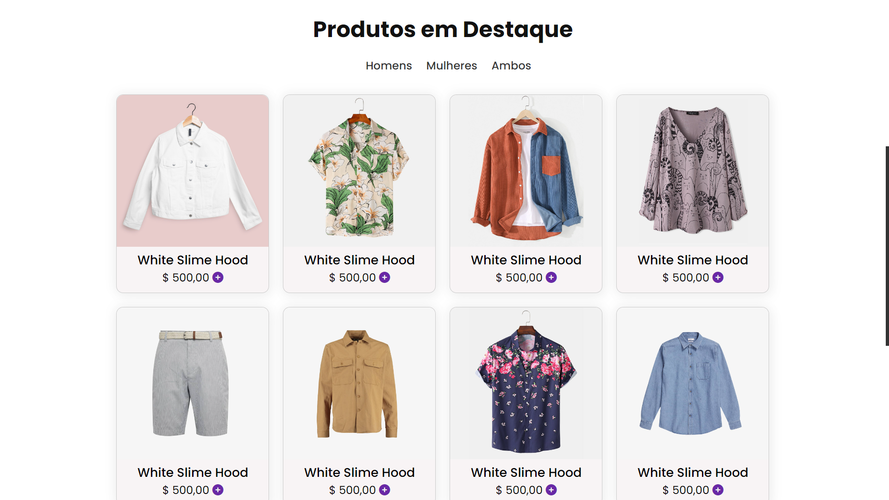
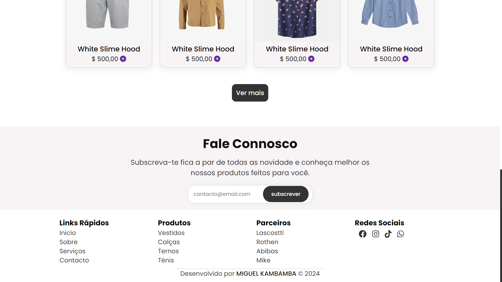

# Projeto de Frontend - Landing Page de E-commerce

Este é um projeto de uma landing page para um e-commerce, desenvolvido como parte de um exercício de frontend. A página oferece uma visão geral dos produtos disponíveis, com uma seção de destaque e um layout responsivo.

## Tecnologias Utilizadas

- **HTML5**: Estrutura da página, garantindo semântica e acessibilidade.
- **CSS3**: Estilização da página, incluindo flexbox e grid layout para responsividade.
- **JavaScript ES6**: Funcionalidades interativas, como navegação entre seções e manipulação do DOM.

## Funcionalidades

- **Seção de Produtos em Destaque**: Produtos organizados por categorias (Homens, Mulheres, Ambos).
- **Layout Responsivo**: Compatível com dispositivos móveis e desktops.
- **Interatividade**: Navegação fácil e rápida através do menu e botões.

## Screenshots

### Versão Desktop

### Versão Mobile

## Como Executar

1. Clone este repositório:
   git clone https://github.com/cambambaPaciencia/simpleEcommerce.git
